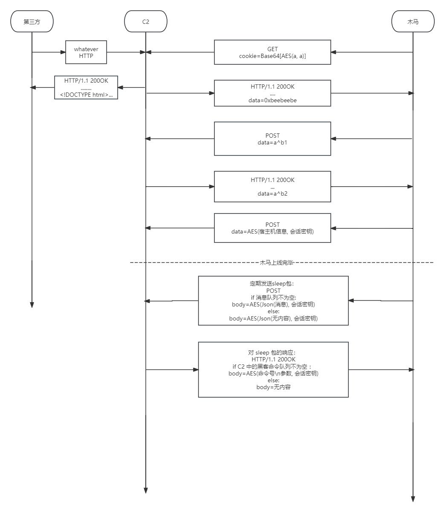

# 木马通信协议设计

## 一、描述

木马与 C2 进行通信时使用 HTTPS 协议，以下的讨论均考虑 HTTP Data 部分的设计。

### 0x00 通信前：

### 0x01 通信前：木马与 C2 的认证

#### 1. 基于离散对数难解性的密钥交换算法

设有一个离散群：$G=\{0,1,2,\dots,p-1\}$，其中，$p$ 是一个素数。如果 $p$ 取的足够大，则 $a\in G,a^b=c\in G$，如果只知道 $a,c$，那么想要解出 $b$ 是非常困难的。因此我这样设计密钥交换算法：

首先 C2 与木马确定一个共同的 $a\in G$，随后二者分别独立确定 $b_1,b_2$，并计算出 $a^{b_1}=c_1\pmod p,a^{b_2}=c_2\pmod p$，然后各自将 $c_1,c_2$ 发送给对方。

这样一来，C2 将拥有 $b_1,c_2=a^{b_2}\pmod p$，木马将拥有 $b_2,c_1=a^{b_1}\pmod p$，因此二者可以各自计算出：$c_2^{b_1}\pmod p=c_1^{b_2}\pmod p=a^{b_1b_2}\pmod p$，而这就是二者进行通信时所用的 AES 密钥了。

#### 2. 认证过程设计

首先，认证交换所使用的这个 $a$，在 Listener 创建时，就在 C2 服务器的内存中生成，直到 Listener 被销毁时也不会改变。同时，在 C2 生成木马时，$a$ 也将写入木马的 config 中。这里，$p$ 取 0x7FFF FFFF FFFF FFFF FFFF FFFF FFFF FFFF，即 $2^{127}-1$，这是一个有符号 128 位整数所允许的最大正整数，也是一个质数。

##### (1) 第一步：密钥交换

木马在靶机上部署完毕后，向 C2 发送一个明文包，包的内容是 16 个字节，也就是一个 128 位的整数，这个整数就是 $a^{b_2}\pmod p$。C2 接收到这样的包后，也发回一个只有 16 字节的明文包，这其实就是 $a^{b_1}\pmod p$，此时，C2 和木马就各自计算出了 $a^{a_1a_2}\pmod p$。

##### (2) 第二步：认证

密钥交换成功后，立刻向 C2 发送一个正常的通信包，[0x01](# 0x01 通信时：木马 → C2) 格式中的这种通信包，里面的 `auth` 字段填写木马的 config 中所具有的认证字符串，同时在 `mtdt` 中填写宿主机的各种信息。C2 接收到这个包后，如果认证字符串通过，则 C2 向木马发送一个新的、随机生成的认证字符串，木马接收到之后，将 config 中的认证字符串修改为这个新的认证字符串，并在后续通信中一直使用它。

当然，从这一步开始，每一步通信都使用第一步中所确定下来的密钥进行 AES 加密。


### 0x02 通信时：木马 → C2

HTTPS 的 Data 内容为：`Base64(AES(明文))` 


明文内容如下：

```json
{
    'mtdt': {
        'h_name': '计算机名',
        'wver':   'windows 版本',
        'arch':   '架构(x86/x64)',
        'bid':    'windows 构建号',
        'p_name': '进程名',
        'uid':    '计算机用户名',
        'pid':    '进程ID',
    },
    'message': '木马发送来的信息',
    'file': {
        'name': '木马发送来的文件名',
        'content': '木马发送的文件内容, 使用Base64进行转码'
    }
}
```

除了 `cds` 外，所有项都是可缺省的。

- 当 C2 接收到的 Json 文本含有 `mtdt` 时，立即更新 C2 上对木马宿主机信息的记录
- `message`：C2 立刻将 message 中的字符串显示在控制台上
-  `file` ：C2 立刻将文件保存到 C2 所在的文件夹

如果认证字符串不匹配，则不执行任何操作。

> 木马需要定期向 C2 发送只含有 `cds` 的包来确定存活


### 0x03 通信时：C2 → 木马

HTTPS 的 Data 内容为：`Base64(AES(明文))`

明文内容如下：

```
命令号
参数
```



## 二、128 bit 无符号整数模 $2^{127}-1$ 乘法的实现

为了实现我们设计的密钥交换算法，需要手动实现 128 位整数的模 $2^{127}-1$ 乘法，为了方便叙述，我们设 $p=2^{127}-1$

设有 $a,b$ 两个 128 位的整数，设它们的高 64 位、低 64 位分别为 $a_H,a_L,b_H,b_L$，则有：
$$
a=a_H*2^{64}+a_L,b=b_H*2^{64}+b_L\\
$$
要计算其乘法，则有：
$$
ab=a_Hb_H2^{128}+a_Lb_H*2^{64}+a_Hb_L2^{64}+a_Lb_L=\\
2a_Hb_H(2^{127}-1)+2a_Hb_H+a_Lb_H*2^{64}+a_Hb_L2^{64}+a_Lb_L
$$
进一步则有：
$$
ab\pmod{2^{127}-1}=2a_Hb_H+a_Lb_L+ 2^{64}(a_Lb_H+a_Hb_L)
$$
我们设
$$
I=2a_Hb_H+a_Lb_L+ 2^{64}(a_Lb_H+a_Hb_L)
$$
这是我们通过公式层面上的分析所得到的一个简化式，我们的程序需要求解出 $I\pmod{2^{127}-1}$，接下来对其进行分析。

首先，我们发现：
$$
I\&p=I\pmod{2^{127}}
$$
其中， & 是按位与符号。这是因为，对 $2^{127}$ 取模，其效果就是从第 127 个二进制位往前的所有二进制位清空，这与对 $p$ 进行按位或的效果相同，因为 $p$ 的二进制形式，就是后 127 位全为 1

我们借助 $I\&p$ 得到了 $I\pmod{2^{127}}$，如果把它看作是模 $2^{127}$ 算出来的，那么，它减了多少次 $2^{127}$ 呢？显然，它减了
$I>>127$ 次 $2^{127}$，（此处 $>>$ 为右移运算符）也就是说：


$$
I\&p=I\pmod {2^{127}}=I-(I>>127)*2^{127}
$$
那么：
$$
I\pmod{2^{127}}+(I>>127)=I-(I>>127)*(2^{127}-1)
$$
这样实际上也就相当于减了足够多次的 $2^{127}-1$，也就得到了 $I\pmod{2^{127}-1}$


